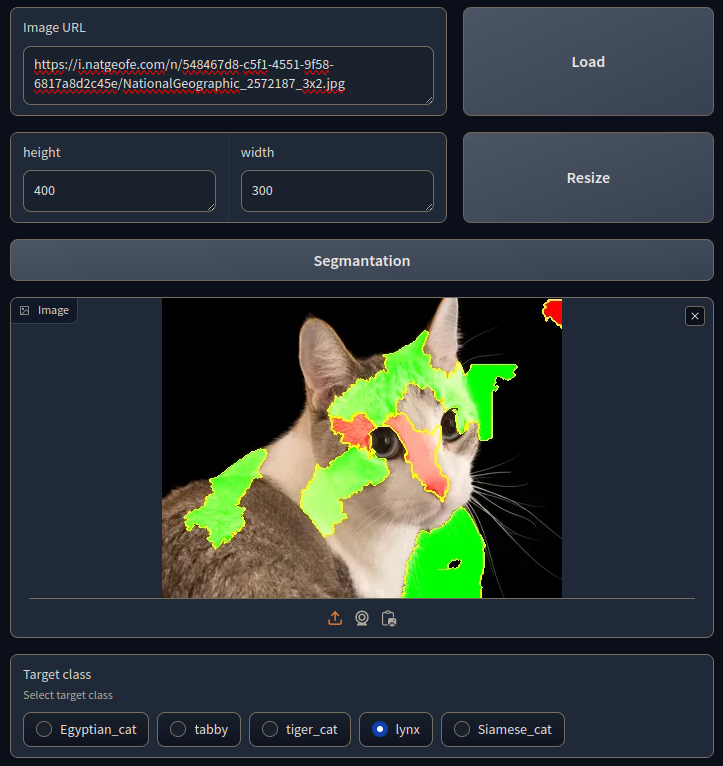

# Interpretable image classification 

## Description
This programm runs Gradio server with interpretator of **Inception_v3** classification model using  [LIME](https://github.com/marcotcr/lime/tree/master) interpretator for explaining individual predictions.



## Setup
`Python 3.11.5`

Set the environment
```
pip install -r requirements.txt
```

## Run 
For running locally | 127.0.0.1:7860 :
```
python main.py
```

## Flags:  
`--share`: Running with public URL.  
`--device`: Device [cpu/cuda] for model computation on either one.  
`--batch_size`: Batch size for LIME model. 